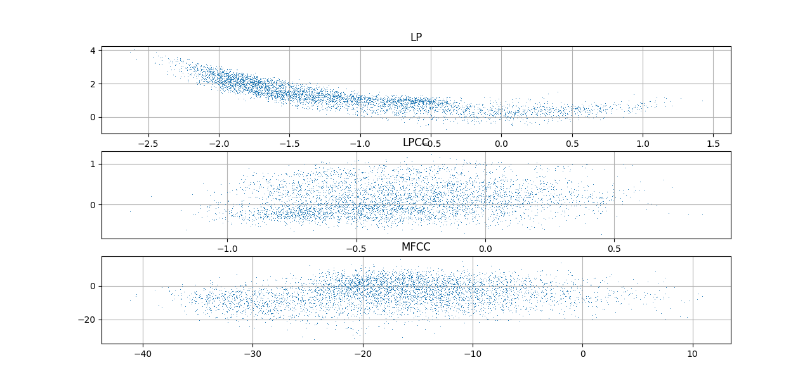
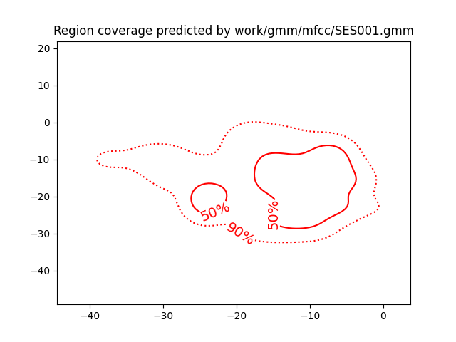
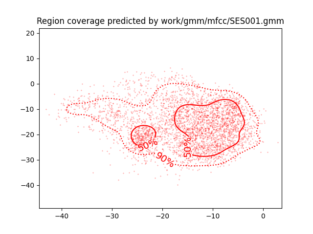
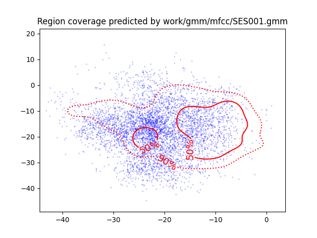
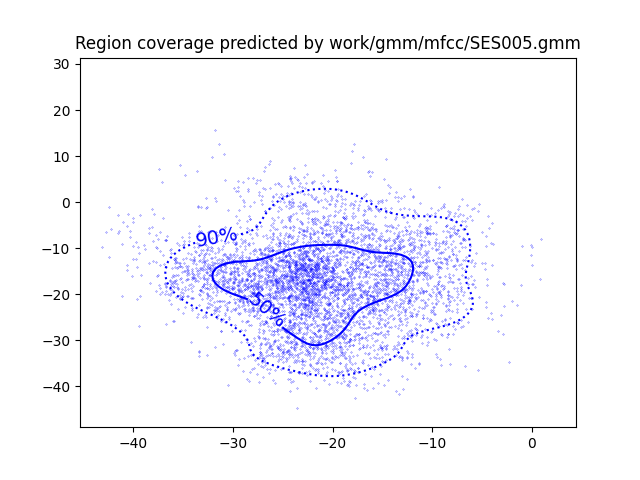
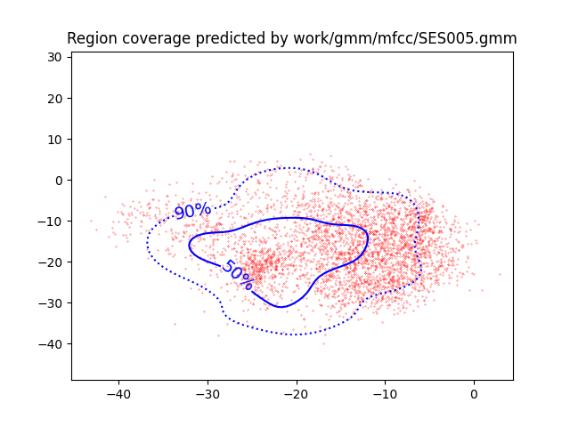

PAV - P4: reconocimiento y verificación del locutor
===================================================

Obtenga su copia del repositorio de la práctica accediendo a [Práctica 4](https://github.com/albino-pav/P4)
y pulsando sobre el botón `Fork` situado en la esquina superior derecha. A continuación, siga las
instrucciones de la [Práctica 2](https://github.com/albino-pav/P2) para crear una rama con el apellido de
los integrantes del grupo de prácticas, dar de alta al resto de integrantes como colaboradores del proyecto
y crear la copias locales del repositorio.

También debe descomprimir, en el directorio `PAV/P4`, el fichero [db_8mu.tgz](https://atenea.upc.edu/pluginfile.php/3145524/mod_assign/introattachment/0/spk_8mu.tgz?forcedownload=1)
con la base de datos oral que se utilizará en la parte experimental de la práctica.

Como entrega deberá realizar un *pull request* con el contenido de su copia del repositorio. Recuerde
que los ficheros entregados deberán estar en condiciones de ser ejecutados con sólo ejecutar:

~~~~~~~~~~~~~~~~~~~~~~~~~~~~~~~~~~~~~~~~~~~~~~~~~~~~~.sh
  make release
  run_spkid mfcc train test classerr verify verifyerr
~~~~~~~~~~~~~~~~~~~~~~~~~~~~~~~~~~~~~~~~~~~~~~~~~~~~~

Recuerde que, además de los trabajos indicados en esta parte básica, también deberá realizar un proyecto
de ampliación, del cual deberá subir una memoria explicativa a Atenea y los ficheros correspondientes al
repositorio de la práctica.

A modo de memoria de la parte básica, complete, en este mismo documento y usando el formato *markdown*, los
ejercicios indicados.

## Ejercicios.

### SPTK, Sox y los scripts de extracción de características.

- Analice el script `wav2lp.sh` y explique la misión de los distintos comandos involucrados en el *pipeline*
  principal (`sox`, `$X2X`, `$FRAME`, `$WINDOW` y `$LPC`). Explique el significado de cada una de las opciones empleadas y de sus valores.
  + `sox`: Es un software the edicion de audio. En `wav2lp.sh` se pasa el fichero de audio con `$inputfile` i se aplican las siguientes opciones:
    - `-t`: Tipo de fichero de audio, en nuestro caso `raw`.
    - `e`: Indica la codificación que se quiere aplicar (signed-integer, unsigned-integer, floating-point, mu-law, a-law, ima-adpcm, ms-adpcm, gsm-full-rate). En nuesta implementación `signed-integer`.
    - `b`: Indica el numero de bits, que son 16.
    - `-`: Redirección del output (pipeline)
  + `$X2X`: Un programa del paquete `SPTK` que sirve para convertir ficheros a diversos formatos.
    - `+sf`: Passa del formato de entrada `s` (short - 2 bytes) a `f` (float - 4 bytes)
  + `$FRAME`: Divide la señal de entrada en tramas con un cierto desplazamiento.
    - `-l`: Indica el número de muestras de cada trama, en este script son 240 muestras, equivalentes a 40ms.
    - `-p`: Muestras de desplazamiento, en el script 80.
  + `$WINDOW`: pondera cada trama con una ventana que por defecto es la Blackman.
    - `-l`: Tamaño de ventana de entrada, en este caso 240 muestras
    - `-L`: Tamaño de ventana de salida, en este caso 240 muestras
  + `$LPC`: Calcula los coeficientes LPC de cada trama enventada del fichero de entrada y la salida tiene formato estandar.
    - `-l`: Tamaño de ventana de entrada, en este caso 240 muestras
    - `-m`: Número de coeficientes LPC.
    
- Explique el procedimiento seguido para obtener un fichero de formato *fmatrix* a partir de los ficheros de
  salida de SPTK (líneas 45 a 47 del script `wav2lp.sh`).
  ```
  # Our array files need a header with the number of cols and rows:
  ncol=$((lpc_order+1)) # lpc p =>  (gain a1 a2 ... ap) 
  nrow=`$X2X +fa < $base.lp | wc -l | perl -ne 'print $_/'$ncol', "\n";'`
  ```
  Se obtienen el número de columnas con el órden de la predicción lineal mas uno ya que también tenemos la ganancia. Esto se realiza mediante la operación aritmética con enteros (()).

  Para las filas se cuentan del fichero donde se han guardado los resultados con el comando wc -l. Antes se ha tenido de convertir de floats a texto ASCII.

  + ¿Por qué es conveniente usar este formato (u otro parecido)? Tenga en cuenta cuál es el formato de
    entrada y cuál es el de resultado.

    De esta forma se pueden ordenar el analisis de las tramas por filas con el mismo número de columnas, formano una matriz.

- Escriba el *pipeline* principal usado para calcular los coeficientes cepstrales de predicción lineal
  (LPCC) en su fichero <code>scripts/wav2lpcc.sh</code>:

  ```bash
  # Main command for feature extration
  `sox $inputfile -t raw -e signed -b 16 - | $X2X +sf | $FRAME -l 240 -p 80 | $WINDOW -l 240 -L 240 | $LPC -l 240 -m $lpc_order | $LPCC -m $lpc_order -M $lpcc_order > $base.lpcc`
  ```
  Donde lpcc_order se calcula como:

  `lpcc_order=echo "scale=0; (($lpc_order * 1.5)+0.5)/1" | bc -l`

- Escriba el *pipeline* principal usado para calcular los coeficientes cepstrales en escala Mel (MFCC) en su
  fichero <code>scripts/wav2mfcc.sh</code>:

  ```bash
  # Main command for feature extration
  sox $inputfile -t raw -e signed -b 16 - | $X2X +sf | $FRAME -l 240 -p 80 | $WINDOW -l 240 -L 240 | $MFCC -s 9 -l 240 -m $mfcc_order -n 40 -w 1 > $base.mfcc
  ```

  El mfcc_order suele ser alrededor de 13 (14 en este caso) para reconocimiento del habla y se usan 40 bandas de Mel.

### Extracción de características.

- Inserte una imagen mostrando la dependencia entre los coeficientes 2 y 3 de las tres parametrizaciones
  para todas las señales de un locutor.
  
  + Indique **todas** las órdenes necesarias para obtener las gráficas a partir de las señales 
    parametrizadas.

    - LP:
      ```
        fmatrix_show work/lp/BLOCK01/SES017/*.lp | egrep '^\[' | cut -f4,5 > lp_2_3.txt
      ```
    - LPCC:
      ```
        fmatrix_show work/lpcc/BLOCK01/SES017/*.lpcc | egrep '^\[' | cut -f4,5 > lpcc_2_3.txt
      ```
    - MFCC:
      ```
        fmatrix_show work/mfcc/BLOCK01/SES017/*.mfcc | egrep '^\[' | cut -f3,4 > mfcc_2_3.txt
      ```
    Con los ficheros de texto se representa las gràficas con Python: 

    ```py
    import matplotlib.pyplot as plt
    import numpy as np

    lp_2_3 = np.loadtxt('lp_2_3.txt')
    lpcc_2_3 = np.loadtxt('lpcc_2_3.txt')
    mfcc_2_3 = np.loadtxt('mfcc_2_3.txt')

    plt.figure()

    plt.subplot(311)
    plt.plot(lp_2_3[:,0], lp_2_3[:,1])
    plt.grid()
    plt.title('LP')


    plt.subplot(312)
    plt.plot(lpcc_2_3[:,0], lpcc_2_3[:,1])
    plt.grid()
    plt.title('LPCC')


    plt.subplot(313)
    plt.plot(mfcc_2_3[:,0], mfcc_2_3[:,1])
    plt.grid()
    plt.title('MFCC')


    plt.show()
    ```
    
    
  + ¿Cuál de ellas le parece que contiene más información?
    Para determinar si los coeficientes contienen más información con las gráficas anteriores se tiene que comparar el nivel de correlación entre coeficientes próximos, quanta más incorrelación más información. Cómo se ha representado los coeficientes 2 y 3 se puede observar muchas diferencias,sobretodo entre los coeficientes LP y el resto.

    + LP: Se ve una fuerte correlación lineal entre los dos coefientes por lo que obtenemos poca información extra.

    + LPCC: Los puntos estan distribuidos en un espacio más parecido a una elipse y  más espaciados entre ellos. Hay más incorrelación y la información obtenida será mayor.

    + MFCC: La distribución es parecida a la anterior pero el rango de valores es superior. Serán los coeficientes más incorrelados.

- Usando el programa <code>pearson</code>, obtenga los coeficientes de correlación normalizada entre los
  parámetros 2 y 3 para un locutor, y rellene la tabla siguiente con los valores obtenidos.

  |                        |     LP    |   LPCC   |    MFCC    |
  |------------------------|:---------:|:--------:|:----------:|
  | &rho;<sub>x</sub>[2,3] | -0.872284 | 0.166388 | -0.0812356 |
  
  + Compare los resultados de <code>pearson</code> con los obtenidos gráficamente.
    Se corresponde con los resultados gráficos ya que para MFCC obtenemos el valor más cercano a 0 y por lo tanto más incorrelado. En cambio para LP se tiene la máxima correlación con el valor más cercano a -1 o 1.
  
- Según la teoría, ¿qué parámetros considera adecuados para el cálculo de los coeficientes LPCC y MFCC?
  Según lo visto en clase los coeficientes habituales para el reconozimiento de voz son unos 13 para LPCC y MFCC. 
  Por eso al calcular los coeficientes cepstrales a partir de la predicción LP (se usan 9 coeficientes) después se multiplicaran por 1.5 llegando a los 14 coeficientes.
  En el caso de los MFCC también se han de configurar el banco de filtros, que en este caso són 40.

### Entrenamiento y visualización de los GMM.

Complete el código necesario para entrenar modelos GMM.

- Inserte una gráfica que muestre la función de densidad de probabilidad modelada por el GMM de un locutor
  para sus dos primeros coeficientes de MFCC.
  
  
- Inserte una gráfica que permita comparar los modelos y poblaciones de dos locutores distintos (la gŕafica
  de la página 20 del enunciado puede servirle de referencia del resultado deseado). Analice la capacidad
  del modelado GMM para diferenciar las señales de uno y otro.
  

  

  

  

### Reconocimiento del locutor.

Complete el código necesario para realizar reconociminto del locutor y optimice sus parámetros.

- Inserte una tabla con la tasa de error obtenida en el reconocimiento de los locutores de la base de datos
  SPEECON usando su mejor sistema de reconocimiento para los parámetros LP, LPCC y MFCC.
  |               |   LP   |  LPCC  |  MFCC | Versión |
  |---------------|:------:|:------:|:-----:|:-------:|
  | Tasa de Error | 40.76% | 13.76% | 4.97% |    1    |
  | Tasa de Error | 11.46% | 2.29%  | 1.02% |    2    |

  Para la versión mejorada el entrenamiento se ha hecho con 50 gaussianas y se ha aumentado el número de iteraciones (30) para hacer el calculo de EM así como se ha reducido el threshold (1e-4), aunque no se ha llegado al límite antes de las 30 iteraciones.

### Verificación del locutor.

Complete el código necesario para realizar verificación del locutor y optimice sus parámetros.

- Inserte una tabla con el *score* obtenido con su mejor sistema de verificación del locutor en la tarea
  de verificación de SPEECON. La tabla debe incluir el umbral óptimo, el número de falsas alarmas y de
  pérdidas, y el score obtenido usando la parametrización que mejor resultado le hubiera dado en la tarea
  de reconocimiento.

  Usando MFCC se obtiene el siguiente resultado:

  |          |   Umbral   |  Falsas alarmas  |  Perdidas | Coste detección |
  |----------|:----------:|:----------------:|:---------:|:---------------:|
  |   MFCC   |   0.2359   |       3/1000     |   14/250  |      8.3        |
  
### Test final

- Adjunte, en el repositorio de la práctica, los ficheros `class_test.log` y `verif_final.log` 
  correspondientes a la evaluación *ciega* final.

### Trabajo de ampliación.

- Recuerde enviar a Atenea un fichero en formato zip o tgz con la memoria (en formato PDF) con el trabajo 
  realizado como ampliación, así como los ficheros `class_ampl.log` y/o `verif_ampl.log`, obtenidos como 
  resultado del mismo.